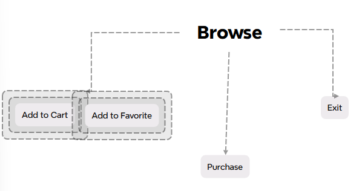
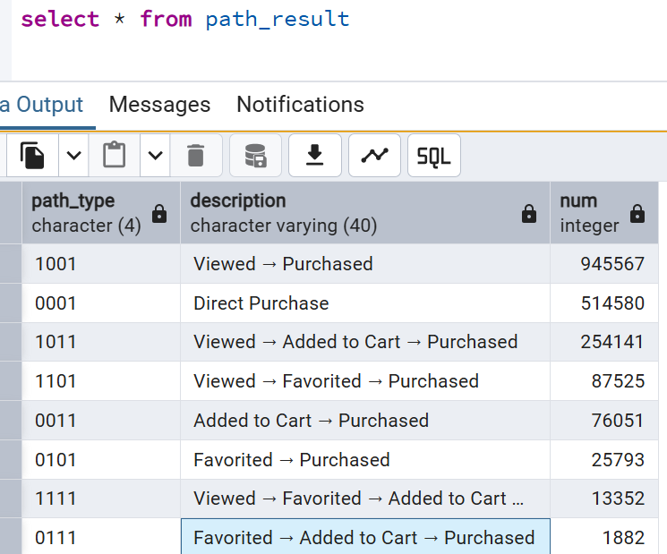
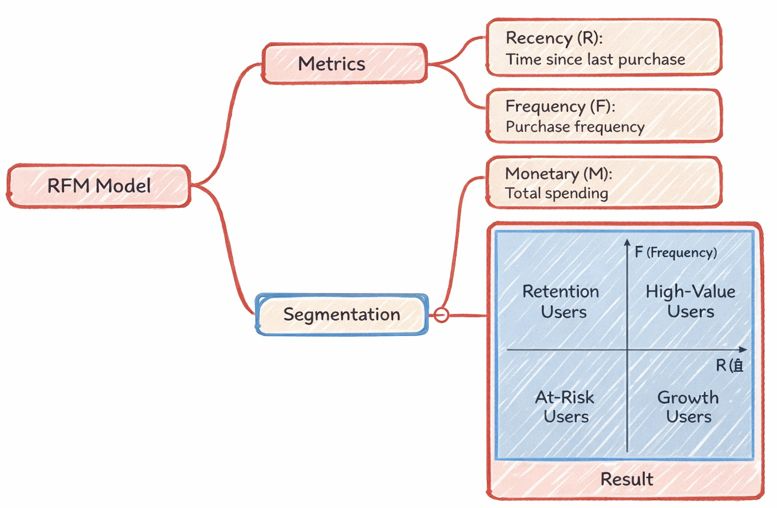
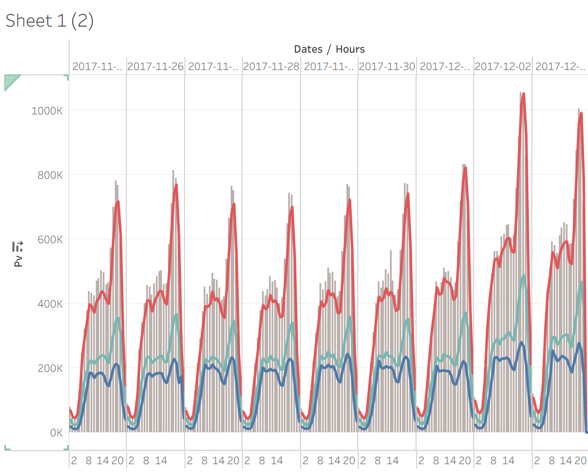
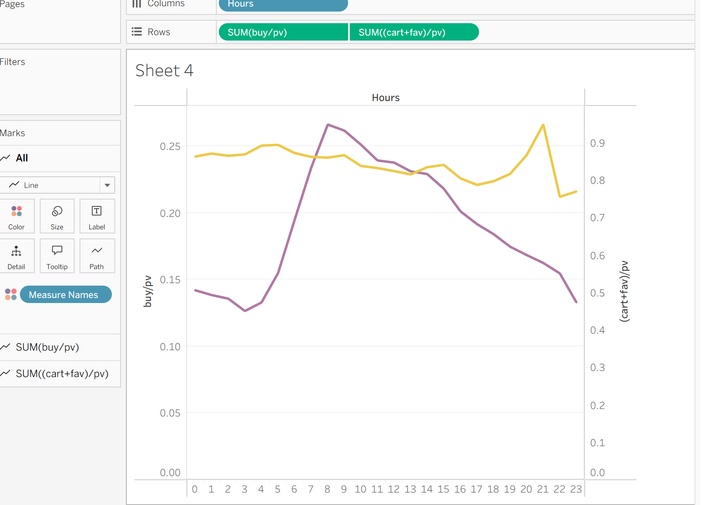
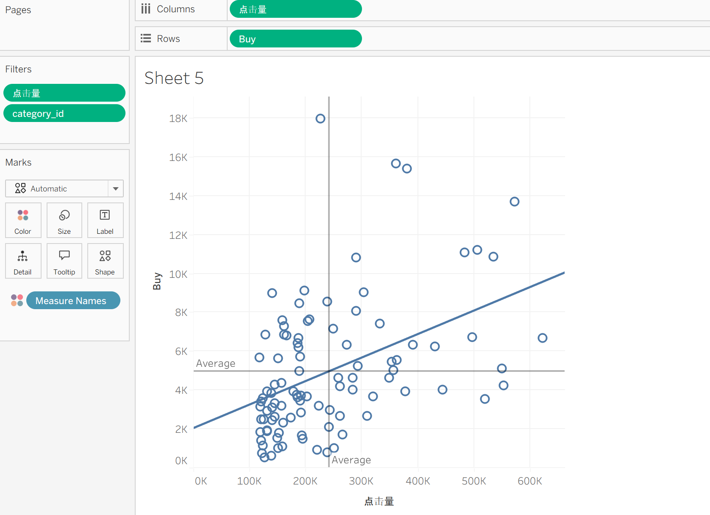

# Taobao Sales Data Analysis Project

  ## 1. Project Overview
  This project focuses on analyzing Taobao e-commerce sales data to uncover patterns in product performance, pricing strategies, and consumer behavior.  
  The analysis aims to transform raw transactional data into actionable insights through data cleaning, exploratory analysis, and visualization.

  This project is designed as a portfolio piece to demonstrate data analysis workflow, analytical thinking, and communication of results.

---
## 2. Project Objectives
  The main objectives of this project are:

  - Understand overall sales performance across products and categories
  - Identify key factors that influence sales volume and revenue
  - Analyze pricing, discounts, and their impact on consumer behavior
  - Extract insights that could support business or marketing decisions

---

## 3. Data Source
  The dataset used in this project comes from Taobao-related e-commerce records.
  The dataset contains approximately 100 million records.

  **Download link (raw data):**  
  [淘宝用户购物行为数据集_数据集-阿里云天池](https://tianchi.aliyun.com/dataset/649)

  [Download from my OneDrive]([TaoBaoUserBehavior.csv.zip](https://1drv.ms/u/c/5217072bd241a833/IQBofrPUwPXaTYvpTwUuxvrwASf-Wp6BGwfTb-pj38qiUco?e=fSeFgh))

  > Note: The dataset is provided for educational and analytical purposes only.

   ### Data Fields Description

| Field Name    | Description                                                  |
| ------------- | ------------------------------------------------------------ |
| User ID       | Integer value representing an anonymized (serialized) user identifier |
| Item ID       | Integer value representing an anonymized (serialized) product identifier |
| Category ID   | Integer value representing an anonymized (serialized) product category identifier |
| Behavior Type | String indicating the type of user behavior (`pv`, `buy`, `cart`, `fav`) |
| Timestamp     | Timestamp indicating when the user behavior occurred         |

---

  ### Behavior Type Definitions

| Behavior Type | Description                                                  |
| ------------- | ------------------------------------------------------------ |
| pv            | Page view of a product detail page, including clicks and browsing actions;browse |
| buy           | Purchase of a product                                        |
| cart          | Adding a product to the shopping cart                        |
| fav           | Adding a product to favorites (wish list)                    |

---

## 5. Import Data

Created a PostgreSQL database

Imported CSV data using `COPY`.

  ## 6. Data Cleaning and Preprocessing

  

  After cleaning, the dataset was suitable for structured analysis.

---

  ## 7. Exploratory Data Analysis (EDA)
  Exploratory analysis was conducted to identify patterns and trends, including:

  - Distribution of sales volume and prices
  - Top-performing products and categories
  - Relationship between price and sales volume
  - Identification of outliers or unusual data points

  Charts and summary statistics were used extensively during this stage.

### 7.1 User Conversion Analysis

Major retailers, including Walmart, have observed that increasing shopping cart capacity can drive higher purchase volumes. Even Amazon has previously incorporated the shopping cart into its branding. As a result, shopping cart conversion rates represent a meaningful metric for analysis.

**Calculated behavior counts using SQL**.

**Conversion Rates**

- **View → Cart Conversion Rate:** 61.71%
- **View → Favorite Conversion Rate:** 32.20%
- **View → Purchase Conversion Rate:** 22.51%
- **Cart → Purchase Conversion Rate:** 36.48%

### 7.2 User Purchase Path Analysis

#### Background and Motivation
In e-commerce platforms, a single purchase is often preceded by multiple user interactions,
such as browsing product pages, adding items to favorites, or adding items to the shopping cart.
Understanding **which types of behaviors tend to occur before a purchase**
can provide valuable insights into user decision-making processes.

Rather than focusing solely on page views or final purchases,
this analysis aims to examine **behavioral patterns leading up to a purchase**
at a more granular level.

---

#### Methodology
The analysis is conducted at the **user–item level**, meaning each record represents
a unique combination of a user and a product.

For each user–item pair:
- User behaviors (`pv`, `fav`, `cart`, `buy`) are aggregated
- The presence of each behavior is converted into a binary indicator
  (1 if the behavior occurred at least once, 0 otherwise)
- A four-digit binary code is generated to represent the purchase path  
  (e.g., `1111` = browsed, favorited, added to cart, and purchased)

Only user–item pairs that resulted in at least one purchase are included in the analysis.
This allows the focus to remain on **paths that successfully converted**.

---

#### Rationale for This Approach
This existence-based path classification is intentionally chosen for several reasons:

- It reduces noise caused by repeated or cyclical behaviors
- It scales efficiently to large datasets (100M+ records)
- It provides clear, interpretable purchase path categories
- It highlights **which behavioral steps tend to appear before conversion**

By abstracting behaviors into binary indicators, the analysis emphasizes
*whether* a behavior occurred, rather than *how many times* or *in what exact order*.

---

#### Key Insights Enabled
This approach enables comparison across different purchase paths, such as:
- Direct purchases without prior engagement
- Purchases following browsing only
- Purchases involving cart or favorite actions
- Purchases involving multiple engagement steps

These patterns help identify which interactions are most strongly associated
with successful conversions.

---

#### Limitations
While effective for large-scale behavioral analysis, this approach has limitations:

- It does not capture the exact temporal sequence of behaviors
- Multiple purchases by the same user for the same item are treated as a single record
- Behaviors occurring after the first purchase are not distinguished
- Session-level dynamics are not explicitly modeled

As a result, this method focuses on **behavioral presence** rather than
fine-grained event sequencing.

### 7.3  RFM-Based User Segmentation

#### Background
In e-commerce analytics, not all users contribute equal value.
Identifying high-value users and understanding different engagement patterns
is essential for personalized marketing, retention strategies, and resource allocation.

To achieve this, an RFM-style model is applied to segment users
based on their purchasing behavior.

---

#### Model Definition
This analysis focuses on two core RFM dimensions:

- **Recency (R):** How recently a user made a purchase
- **Frequency (F):** How often a user made purchases

> Monetary value (M) is not included in this dataset and is therefore excluded from the model.

---

#### Data Preparation
User purchase behavior is aggregated at the **user level**:

- Only `buy` events are considered
- Each user is summarized by:
  - Total number of purchases (Frequency)
  - Most recent purchase date (Recency)

This aggregation ensures that each user is represented by a single record.

---

#### Scoring Methodology

#### Frequency Scoring (F-score)
Users are scored based on their total purchase frequency:

| Purchase Count Range | F-score |
| -------------------- | ------- |
| 40–262               | 5       |
| 30–39                | 4       |
| 20–29                | 3       |
| 10–19                | 2       |
| < 10                 | 1       |

Higher scores indicate stronger purchase engagement.

---

#### Recency Scoring (R-score)
Users are scored based on their most recent purchase date:

| Most Recent Purchase Date | R-score |
| ------------------------- | ------- |
| 2017-12-03                | 5       |
| 2017-12-01 to 2017-12-02  | 4       |
| 2017-11-29 to 2017-11-30  | 3       |
| 2017-11-27 to 2017-11-28  | 2       |
| Earlier dates             | 1       |

More recent purchases receive higher scores.

---

#### User Segmentation Logic
After scoring, average values of **F-score** and **R-score** are used as thresholds.
Users are then segmented into four categories:

| Segment              | Definition                               |
| -------------------- | ---------------------------------------- |
| **High-Value Users** | High frequency and recent purchases      |
| **Retention Users**  | High frequency but less recent purchases |
| **Growth Users**     | Low frequency but recent purchases       |
| **At-Risk Users**    | Low frequency and less recent purchases  |

This segmentation aligns with standard RFM matrix interpretation.

---

#### Interpretation of Segments
- **High-Value Users:** Core customers with strong engagement and high loyalty
- **Retention Users:** Previously active users who may require re-engagement
- **Growth Users:** Recently active users with potential to increase purchase frequency
- **At-Risk Users:** Users with low engagement who may churn without intervention

#### Result

---

#### Advantages of This Approach
- Simple and interpretable segmentation logic
- Scales efficiently to large user datasets
- Directly actionable for marketing and retention strategies
- Aligns with widely accepted RFM analysis practices

---

#### Limitations
- Monetary value is not included in the model
- Frequency thresholds are rule-based rather than distribution-based
- Temporal granularity is limited to purchase dates only
- User behavior outside purchases is not considered

Despite these limitations, the model provides a practical and effective framework
for user segmentation in large-scale e-commerce analysis.

---

  ## 8. Visualization Highlights
Tool:Tableau

  - Temporal Pattern Analysis

This visualization analyzes hourly user behavior patterns across multiple days,
showing how page views, favorites, cart additions, and purchases evolve over time.
The chart highlights strong daily cycles and demonstrates that conversion-related behaviors
closely follow traffic peaks, indicating time-dependent user engagement.

  - Hourly Conversion Efficiency Analysis

This visualization examines hourly conversion efficiency by normalizing user actions
against page views.
While traffic volume peaks in the evening, the purchase conversion rate (buy/pv)
reaches its highest levels during mid-morning hours.
This indicates that higher traffic does not necessarily correspond to higher conversion efficiency,
highlighting distinct time windows for engagement versus actual purchasing behavior.

  - Clicks vs Purchases by Category

It analyzes the relationship between traffic volume (clicks) and purchase outcomes across product categories.

---

### 9. Project Link

[Taobao Data Analysis](https://github.com/PK-wwj/DataAnalysis-Taobao.git)