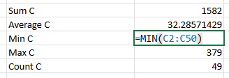

1. *Format the data as a table:** Use the Format as Table option to format the data as a table.

   Choose all data, Insert->Table

2. **Use AutoSum to calculate values:** Use AutoSum to find the following values for column ‘C’ and record each of the values:

   - SUM

   - AVERAGE

   - MIN

   - MAX

   - COUNT 

     

     use function

3. **Create a Pivot Table:** Use the PivotTable feature to create a pivot table that displays the Department field in the Rows section, and the Equipment Count in the Values section, so that the pivot table displays the sum of equipment count by department.

   Insert -> Pivot Table

4. **Sort the pivot table data:** Use the Sort By Value setting on the pivot table to sort it in descending order by the sum of equipment count.

   click A2 down arrow ,choose sort by value

   

5. **Make two more pivot tables exactly the same as task 3:** Follow the same steps you performed in Tasks 3 and 4 to create two more identical pivot tables so that you end up with 3 worksheets that contain identical pivot tables.

6. **Analyze data in the pivot table:** Use the PivotTable Fields pane to manipulate and analyze data in the two copied pivot table as follows:

   - In pivot table 2 add the Equipment Class field below the Department field so that the different vehicle types appear under each department with their respective counts.
   - Collapse all fields except the top one - **Transportation**

   

   - In pivot table 3 add the Equipment Class field above the Department field so that the different vehicle types appear first, with the different departments listed underneath each vehicle type with their respective counts.
   - Collapse all fields except the top one - **CUV**

   

   
